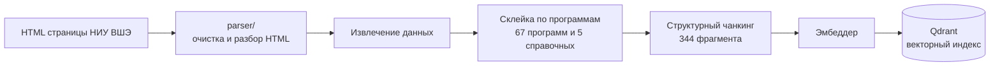
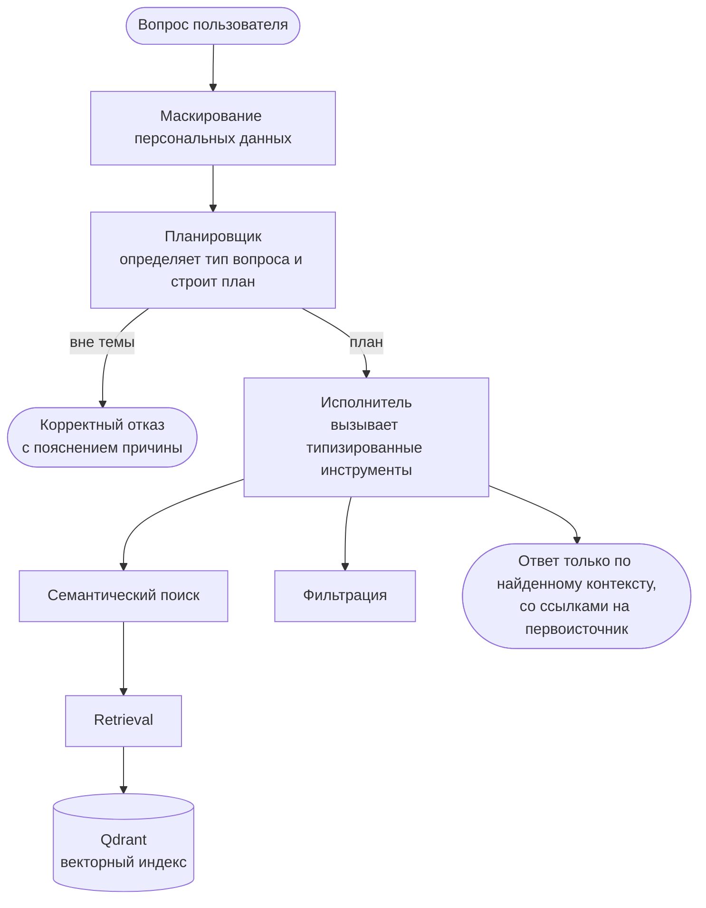

# Чат-бот для абитуриентов НИУ ВШЭ

Данный репозиторий является кодовой частью курсовой работы по программе «Прикладная математика и информатика» (ФКН НИУ ВШЭ). В работе рассматривается разработка консультационного чат-бота для абитуриентов бакалавриата. Здесь собран весь код, на котором построен отчёт, а именно сбор данных, поисковый пайплайн, агентный слой, Telegram-бот и эксперименты.

## О проекте

Прототип отвечает на вопросы о поступлении в бакалавриат НИУ ВШЭ по официальным материалам университета, среди которых правила приёма, экзамены, проходные баллы, стоимость, сроки и содержание программ. В основе лежит подход Retrieval-Augmented Generation (RAG). Система не придумывает ответ, а сначала находит релевантные фрагменты в корпусе официальных документов, и только потом языковая модель формирует ответ строго по этому контексту и со ссылкой на первоисточник.

Поверх линейного RAG надстроен агентный слой по схеме «планировщик и исполнитель» (Plan-and-Execute). Подход позволяет не только искать текст, но и фильтровать программы по условиям, сравниваеть их и сопоставлять баллы абитуриента с проходными прошлых лет. Конфигурация поиска (предобработку запроса, разбиение корпуса, модель эмбеддингов, реранкер и модели для ролей) выбралась экспериментально на размеченном наборе запросов.

## Как это работает

Система состоит из двух частей. Сначала офлайн собирается и индексируется корпус официальных материалов, а затем онлайн на каждый вопрос строится ответ через агентный слой.

### Подготовка корпуса (офлайн)



### Ответ на вопрос (онлайн)



## Структура репозитория

```text
HSE-chatbot/
├── parser/         сбор данных с сайта НИУ ВШЭ
├── rag/            ядро
│   ├── agent/        планировщик, исполнитель, инструменты
│   ├── chunking/     нарезка документов на фрагменты
│   ├── embedding/    перевод текстов в векторное представление
│   ├── indexing/     векторный индекс (Qdrant)
│   ├── retrieval/    плотный поиск, BM25, RRF, реранкер
│   ├── generation/   сбор финального ответа
│   └── experiments/  эксперименты
├── bot/            Telegram-бот и защита персональных данных
├── config/         параметры системы
├── data/           корпус (67 программ, 5 справочных) и индекс
└── experiments/    golden-набор запросов и результаты экспериментов
```

## Запуск

Понадобятся Python 3.11+ и [uv](https://github.com/astral-sh/uv).

```bash
uv sync                  # установить зависимости
cp .env.example .env     # заполнить ключи
uv run hse-rag chunk     # нарезать корпус на фрагменты
uv run hse-rag index     # построить векторный индекс
uv run hse-bot           # запустить Telegram-бота
```

Проверить ответ можно прямо в консоли, без Telegram.

```bash
uv run hse-rag agent "<запрос>"
```

### Ключи в `.env`

```
OPENROUTER_API_KEY=...
TELEGRAM_BOT_TOKEN=...
OPENROUTER_MODEL=anthropic/claude-haiku-4.5   # модель по умолчанию
```

## Воспроизведение экспериментов

Эксперименты считаются на размеченном golden-наборе (`experiments/golden_set/`). Перед запуском соберите индекс (`chunk` и `index`) и заполните `OPENROUTER_API_KEY`.

```bash
uv run hse-rag experiment preprocessing      # сравнение стратегий предобработки запроса
uv run hse-rag experiment chunking           # сравнение стратегий разбиения корпуса
uv run hse-rag experiment embedder           # сравнение моделей эмбеддингов
uv run hse-rag experiment hybrid             # сравнение плотного и гибридного поиска
uv run hse-rag experiment reranker --llm     # сравнение схем переранжирования
uv run hse-rag experiment generation_method  # сравнение агентной и линейной генерации
```

Каждая серия пишет результат в `experiments/results/` в формате JSON.